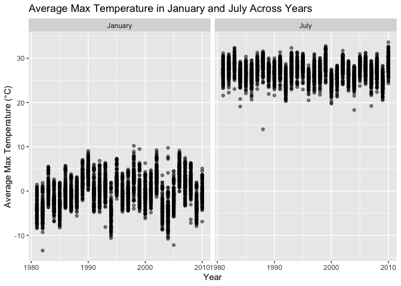
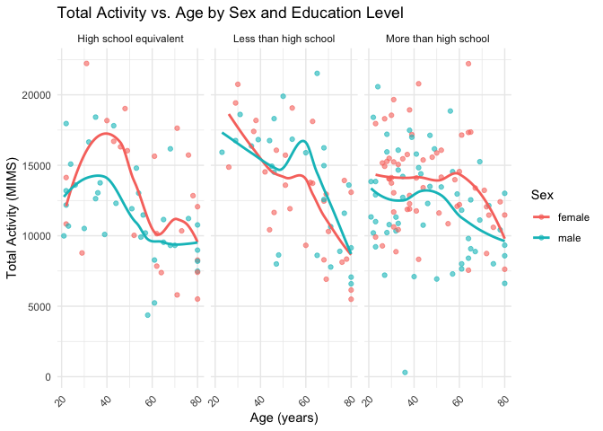
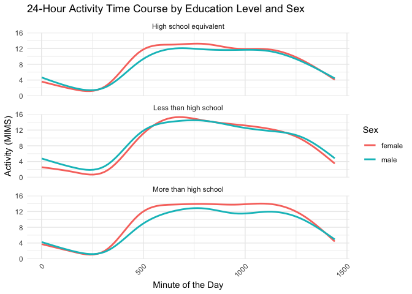
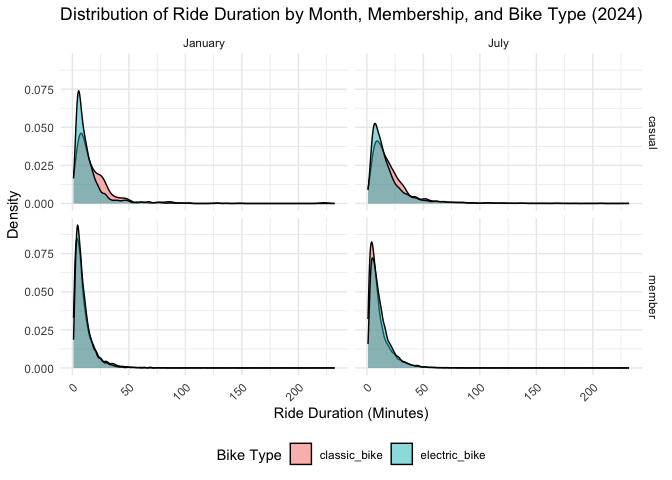

p8105_hw3_tq2171
================
Tingyu Qian
2024-10-9

## Problem 1

``` r
# load the library and the dataset
library(p8105.datasets)
data("ny_noaa")
```

In the dataset “ny_noaa”, it contains 2595176 and 7 columns, which means
there are 7 variables. Name of the 7 variables are the following: id,
date, prcp, snow, snwd, tmax, tmin.

The following are the variables introduction:

id: Weather station ID

date: Date of observation

prcp: Precipitation (tenths of mm)

snow: Snowfall (mm)

snwd: Snow depth (mm)

tmax: Maximum temperature (tenths of degrees C)

tmin: Minimum temperature (tenths of degrees C)

The type of each variable are the following: id is character, date is
Date, prcp is integer, snow is integer, snwd is integer, tmax is
character, tmin is character. Variables “prcp”, “snow”, “snwd” are the
integer variables. Variables “id”, “tmax” and “tmin” are character
variables. There are 145838 or 5.62% missing value in the variable
“prcp”, 381221 or 14.69% missing value in the variable “snow”, 591786 or
22.8% missing value in the variable “snwd”, 1134358 or 43.71% missing
value in the variable “tmax” and 1134420 or 43.71% missing value in the
variable “tmin”.

``` r
#load the needed library
library(lubridate)
```

``` r
# Create separate variables for year, month, and day
ny_noaa$year <- year(ny_noaa$date)
ny_noaa$month <- month(ny_noaa$date)
ny_noaa$day <- day(ny_noaa$date)
```

``` r
# Precipitation (prcp): Currently in tenths of mm, divide by 10 to convert to millimeters (mm).
ny_noaa$prcp_mm <- ny_noaa$prcp / 10

# Maximum temperature (tmax): In tenths of degrees Celsius, divide by 10 to convert to degrees Celsius.
ny_noaa$tmax <- as.numeric(ny_noaa$tmax)
ny_noaa$tmax_c <- ny_noaa$tmax / 10

#Minimum temperature (tmin): In tenths of degrees Celsius, divide by 10 to convert to degrees Celsius.
ny_noaa$tmin <- as.numeric(ny_noaa$tmin)
ny_noaa$tmin_c <- ny_noaa$tmin / 10
```

``` r
#Identify the most commonly observed values in "snowfall"

# Count occurrences of each snowfall value
snowfall_counts <- table(ny_noaa$snow)
# Sort the counts in descending order to find the most common values
sorted_snowfall <- sort(snowfall_counts, decreasing = TRUE)
# Display the most common snowfall values
head(sorted_snowfall)
```

    ## 
    ##       0      25      13      51      76       8 
    ## 2008508   31022   23095   18274   10173    9962

The high frequency of 0 snowfall values in the dataset, with over 2
million occurrences, likely reflects the fact that snowfall is not a
daily event in many regions, especially outside of winter months. Other
smaller values, like 25, 13, and 51 mm, represent light snowfalls, which
occur less frequently but are still common in regions with occasional
snow. The predominance of zero snowfall days is expected when
considering regions that experience seasonal snow or generally warmer
climates.

``` r
# Load necessary libraries
library(dplyr)
```

    ## 
    ## Attaching package: 'dplyr'

    ## The following objects are masked from 'package:stats':
    ## 
    ##     filter, lag

    ## The following objects are masked from 'package:base':
    ## 
    ##     intersect, setdiff, setequal, union

``` r
library(ggplot2)
```

``` r
# Filter for January (1) and July (7)
jan_july_data <- ny_noaa %>% 
  filter(month %in% c("1", "7")) %>%
  mutate(month_name = ifelse(month == "1", "January", "July"))
```

``` r
# Group by station, year, and month, and calculate average max temperature (tmax) per station and month
avg_temp <- jan_july_data %>%
  group_by(id, year, month_name) %>%
  summarise(avg_tmax = mean(tmax_c, na.rm = TRUE))
```

    ## `summarise()` has grouped output by 'id', 'year'. You can override using the
    ## `.groups` argument.

``` r
# Remove any missing values (if needed)
avg_temp <- avg_temp %>% filter(!is.na(avg_tmax))
# Create a two-panel plot
ggplot(avg_temp, aes(x = year, y = avg_tmax)) +
  geom_point(alpha=0.5) +
  facet_grid(~ month_name) +# Create two panels for January and July
  labs(title = "Average Max Temperature in January and July Across Years",
       x = "Year",
       y = "Average Max Temperature (°C)") +
  theme(legend.position = "bottom")
```

<!-- -->

The plot shows clear seasonal differences between January and July
temperatures. In January, there is an observable warming trend starting
around 1990, with average maximum temperatures increasing over time,
possibly suggesting the effects of climate change on winter
temperatures. January temperatures often fall below 0°C, with some
notable dips close to or below -10°C, indicating particularly cold years
or regions. In contrast, July temperatures are more consistent, with
average maximum temperatures generally between 25°C and 30°C, showing
less variability than January.

There are also some outliers present in the data. In January, certain
years show unusually low temperatures, which may represent colder than
average years. In July, a few temperatures drop below 20°C, which is
unusual for summer and could either reflect rare cooler summers or
potential data errors. The overall trend suggests a warming pattern in
January, while July temperatures appear more stable.

``` r
# tmax vs tmin plot (using density plot)
tmax_tmin_density_plot <- ggplot(ny_noaa) +
  geom_density(aes(x = tmax_c, fill = "tmax"), alpha = 0.5) +  # Density for tmax
  geom_density(aes(x = tmin_c, fill = "tmin"), alpha = 0.5) +  # Density for tmin
  scale_fill_manual(values = c("tmax" = "red", "tmin" = "blue")) +
  labs(title = "Density Plot of tmax and tmin",
       x = "Temperature (°C)",
       fill = "Variable") +
  theme_minimal()
```

``` r
snow_filtered <- ny_noaa %>%
  filter(snow > 0 & snow < 100)

# Snowfall distribution (snowfall > 0 and < 100) by year
snowfall_violin_plot <- ggplot(snow_filtered, aes(x = year, y = snow)) +
  geom_violin(aes(fill = year)) +  # Violin plot showing distribution by year
  labs(title = "Snowfall Values Distribution (0 < snow < 100) by Year",
       x = "Year",
       y = "Snowfall (mm)")

# Display violin plot
snowfall_violin_plot
```

    ## Warning: The following aesthetics were dropped during statistical transformation: fill.
    ## ℹ This can happen when ggplot fails to infer the correct grouping structure in
    ##   the data.
    ## ℹ Did you forget to specify a `group` aesthetic or to convert a numerical
    ##   variable into a factor?

<!-- -->

# Problem 2

``` r
## read and clean the data
library(tidyverse) 
nhanes_accel = read_csv (file = "./nhanes_accel.csv", na = c("NA", ".")) #read the data
nhanes_covar = read_csv (file = "./nhanes_covar.csv", na = c("NA", "."), skip=4) #read the data
```

``` r
# Rename columns in the covariates dataset and convert to appropriate types
nhanes_covar <- 
  nhanes_covar %>%
  mutate(
    sex = recode(sex, `1` = "male", `2` = "female"),
    education = recode(education, 
                       `1` = "Less than high school", 
                       `2` = "High school equivalent", 
                       `3` = "More than high school"),
    age = as.numeric(age),  # Ensure age is numeric
    BMI = as.numeric(BMI)   # Ensure BMI is numeric
  )
```

``` r
# Merge the nhanes_accel dataset and nhanes_covar dataset by 'SEQN'
nhanes_merged <- nhanes_covar %>%
  inner_join(nhanes_accel, by = "SEQN")
```

``` r
# Exclude participants under 21 years of age
nhanes_merged <- nhanes_merged %>%
  filter(age >= 21)
```

``` r
# Remove rows with missing demographic data
nhanes_merged <- nhanes_merged %>%
  drop_na(sex, age, BMI, education)
```

``` r
# Create a summary table of the number of men and women in each education category
gender_education_table <- nhanes_merged %>%
  group_by(education, sex) %>%
  summarise(count = n()) %>%
  ungroup() %>%
  arrange(education, sex)

# Pivot the table to make it wider with education as columns
pivoted_table <- gender_education_table %>%
  pivot_wider(
    names_from = education,
    values_from = count,
    values_fill = 0)  # Fill missing values with 0
```

``` r
library(knitr)
```

``` r
# Display the table using kable for a reader-friendly format
kable(pivoted_table, 
      col.names = c("Gender", "Less than HighSchool", "HighSchool Equivalent", "More than HighSchool"),
      caption = "Gender Distribution Across Education Levels")
```

| Gender | Less than HighSchool | HighSchool Equivalent | More than HighSchool |
|:-------|---------------------:|----------------------:|---------------------:|
| female |                   23 |                    28 |                   59 |
| male   |                   35 |                    27 |                   56 |

Gender Distribution Across Education Levels

``` r
# Visualize the age distributions for men and women within each education category
ggplot(nhanes_merged, aes(x = age, fill = sex)) +
  geom_density(alpha = 0.5) +  # Density plot with transparency for overlapping areas
  facet_wrap(~ education) +  # Facet by education category
  labs(title = "Age Distributions by Sex and Education Category",
       x = "Age (years)",
       y = "Density",
       fill = "Sex") +
  theme_minimal()
```

<!-- -->

The age distributions by sex across the three education categories
reveal distinct patterns. In the “High School Equivalent”, men have a
peak at 20-40 and 50-60 ages, while women have a peak at 60-80 ages .
There is some overlap between the distributions, but men slightly
dominate in younger ages, while women are more represented at older
ages. In the “Less than high school” category, the age distribution for
women skews toward older ages, with a significant peak around the 70 to
80-year range, suggesting that this group has more older women. For men,
the distribution covers a wider age range, with peaks appearing in both
middle-aged (40-50 years) and older (70-80 years) groups. In the “More
than high school” category, the age distributions suggest that women are
more concentrated in younger age ranges, with a noticeable peak around
20 to 40 years, while the distribution for men spans a broader range,
with a slightly higher density in younger ages (30-50 years). This may
suggest that women are likely to pursued higher education at younger
ages than men.

``` r
# Sum total activity for each participant across all minute columns
nhanes_total_activity <- 
  nhanes_merged %>%
  rowwise() %>%
  mutate(total_activity = sum(c_across(starts_with("min")), na.rm = TRUE)) %>%
  ungroup()
```

``` r
# Create the scatterplot of total activity vs. age, with separate panels for education
ggplot(nhanes_total_activity, aes(x = age, y = total_activity, color = sex)) +
  geom_point(alpha = 0.6) +  # Scatterplot with transparency
  geom_smooth(method = "loess", se = FALSE) +  # Add smooth trend lines
  facet_wrap(~ education) +  # Separate panels for each education category
  labs(
    title = "Total Activity vs. Age by Sex and Education Level",
    x = "Age (years)",
    y = "Total Activity (MIMS)",
    color = "Sex"
  ) +
  theme_minimal() +
  theme(axis.text.x = element_text(angle = 45, hjust = 1))
```

    ## `geom_smooth()` using formula = 'y ~ x'

<!-- -->

The plot shows the relationship between total activity (MIMS) and age,
separated by education level and sex. Across all education categories,
there is a noticeable decline in total activity with increasing age,
although the trends differ slightly between men and women.

In the High School Equivalent category, both men and women exhibit a
peak in activity around the 30 to 40-year range, followed by a steady
decline, with women generally maintaining higher activity levels than
men.

In the Less than High School category, there is a steeper decline in
activity for both men and women as age increases. Women show higher
activity levels compared to men in earlylife (20 to 40 years), but both
sexes converge to lower levels as they approach older age (70+ years).

In the More than High School category, activity levels are more stable
over time, with smaller declines compared to the other education levels.
Men and women exhibit relatively similar activity levels in this group,
suggesting that individuals with higher education may maintain more
consistent activity levels throughout life.

``` r
# Reshape the data to long format for plotting (gather all minute columns into one)
nhanes_long <- nhanes_merged %>%
  pivot_longer(
    cols = starts_with("min"), 
    names_to = "minute", 
    values_to = "activity"
  ) %>%
  mutate(
    minute = as.numeric(gsub("min", "", minute))  # Convert minute column to numeric
  )

# Create the three-panel plot
ggplot(nhanes_long, aes(x = minute, y = activity, color = sex)) +
  geom_smooth(se = FALSE) +  # Add smooth trend lines for activity throughout the day
  facet_wrap(~ education, ncol = 1) +  # Create separate panels for each education level
  labs(
    title = "24-Hour Activity Time Course by Education Level and Sex",
    x = "Minute of the Day",
    y = "Activity (MIMS)",
    color = "Sex"
  ) +
  theme_minimal() +
  theme(axis.text.x = element_text(angle = 45, hjust = 1))
```

    ## `geom_smooth()` using method = 'gam' and formula = 'y ~ s(x, bs = "cs")'

<!-- -->

The 24-hour activity time course plot reveals clear daily activity
patterns across different education levels, with some similarities and
subtle differences between men and women. Across all three education
levels—“High school equivalent,” “Less than high school,” and “More than
high school”—activity levels increase steadily in the morning (around
minute 500, corresponding to 8–9 AM), peak around midday and early
afternoon, and decline in the evening. There are small differences
between men and women, with women generally showing slightly higher
activity levels throughout the day, especially in the “More than high
school” category. This might reflect more structured or habitual
physical activities among women with higher education. Meanwhile, the
“Less than high school” group shows slightly more variability in
activity levels during peak hours. Overall, the pattern is consistent:
activity peaks around midday and declines steadily toward the evening,
with education level appearing to influence the smoothness and
consistency of daily activity patterns.

# Problem 3

``` r
#Import the datasets
jan_2020 <- read_csv("./Jan 2020 Citi.csv")
jan_2024 <- read_csv("./Jan 2024 Citi.csv")
jul_2020 <- read_csv("./July 2020 Citi.csv")
jul_2024 <- read_csv("./July 2024 Citi.csv")
```

``` r
# Combine the datasets into one
all_rides <- bind_rows(
  jan_2020 %>% mutate(month = "January", year = 2020),
  jan_2024 %>% mutate(month = "January", year = 2024),
  jul_2020 %>% mutate(month = "July", year = 2020),
  jul_2024 %>% mutate(month = "July", year = 2024)
)
```

``` r
# Group by year, month, and membership type to calculate total rides
ride_summary <- all_rides %>%
  group_by(year, month, member_casual) %>%
  summarise(total_rides = n()) %>%
  ungroup()
```

``` r
# Pivot to create a reader-friendly table
reader_friendly_table <- ride_summary %>%
  pivot_wider(names_from = member_casual, values_from = total_rides, values_fill = 0)

# Display the table using kable()
kable(reader_friendly_table, 
      col.names = c("Year", "Month", "Casual Riders", "Members"),
      caption = "Total Rides by Year, Month, and Membership Type",
      align = "lccc")  # Align columns: left for year, center for others
```

| Year |  Month  | Casual Riders | Members |
|:-----|:-------:|:-------------:|:-------:|
| 2020 | January |      984      |  11436  |
| 2020 |  July   |     5637      |  15411  |
| 2024 | January |     2108      |  16753  |
| 2024 |  July   |     10894     |  36262  |

Total Rides by Year, Month, and Membership Type

The summary table reveals a clear seasonal trend in Citi Bike usage,
with more rides occurring in July compared to January, reflecting
increased activity during warmer months. From 2020 to 2024, there is a
significant increase in both casual and member rides, indicating growing
adoption of the bike-sharing service. Notably, casual rides more than
doubled over this period, with 2108 rides in January 2024 compared to
984 rides in January 2020, and 10894 rides in July 2024 compared to 5637
rides in July 2020. This suggests expanding interest from non-members.
Meanwhile, member rides also increased steadily, from 15411 in July 2020
to 36262 in July 2024, highlighting continued value for regular users.
These trends suggest that Citi Bike is growing in popularity, attracting
both casual users and maintaining engagement with members throughout the
years.

``` r
# Filter the data for July 2024
july_2024_data <- all_rides %>%
  filter(year == 2024, month == "July")

# Group by start station and count the number of rides originating from each station
top_stations <- july_2024_data %>%
  group_by(start_station_name) %>%
  summarise(num_rides = n()) %>%
  arrange(desc(num_rides)) %>%
  slice_head(n = 5)  # Select the top 5 stations

# Display the table
print(top_stations)
```

    ## # A tibble: 5 × 2
    ##   start_station_name       num_rides
    ##   <chr>                        <int>
    ## 1 Pier 61 at Chelsea Piers       163
    ## 2 University Pl & E 14 St        155
    ## 3 W 21 St & 6 Ave                152
    ## 4 West St & Chambers St          150
    ## 5 W 31 St & 7 Ave                146

``` r
# Calculate the median ride duration for each combination of day, month, and year
median_duration_data <- all_rides %>%
  group_by(weekdays, month, year) %>%
  summarise(median_duration = median(duration, na.rm = TRUE)) %>%
  ungroup()
```

``` r
# Create the plot
ggplot(median_duration_data, aes(x = weekdays, y = median_duration, fill = factor(year))) +
  geom_bar(stat = "identity", position = "dodge") +  # Bar plot to compare median durations
  facet_wrap(~ month, ncol = 2) +  # Create separate panels for each month
  labs(
    title = "Median Ride Duration by Weekday, Month, and Year",
    x = "Day of the Week",
    y = "Median Ride Duration (Minutes)",
    fill = "Year"
  ) +
  theme_minimal() +
  theme(axis.text.x = element_text(angle = 45, hjust = 1))
```

<!-- -->

The plot highlights how median ride durations vary by day of the week,
month, and year. In both January and July, weekends (especially
Saturdays and Sundays) tend to have the longest median ride durations,
reflecting increased recreational use during leisure days. The effect is
more pronounced in July, where weekend rides in 2020 exhibit notably
longer durations compared to those in 2024. Across weekdays, the
differences between 2020 and 2024 are more distinct in July compared to
January. However, the overall trend indicates that ride durations are
longer in 2020 than in 2024 for both months. This plot provides insight
into how bike usage varies by day, season, and year, emphasizing the
importance of weekends and summer months for longer, likely
recreational, rides.

``` r
# Filter the data for 2024
data_2024 <- all_rides  %>%
  filter(year == 2024)

# Create the plot to show distribution of ride duration by month, membership, and bike type
ggplot(data_2024, aes(x = duration, fill = rideable_type)) +
  geom_density(alpha = 0.5) +  # Use density plot to show distribution
  facet_grid(member_casual ~ month) +  # Facet by membership status and month
  labs(
    title = "Distribution of Ride Duration by Month, Membership, and Bike Type (2024)",
    x = "Ride Duration (Minutes)",
    y = "Density",
    fill = "Bike Type"
  ) +
  theme_minimal() +
  theme(
    legend.position = "bottom", 
    axis.text.x = element_text(angle = 45, hjust = 1)
  )
```

<!-- -->

The plot reveals distinct patterns in ride duration based on month,
membership status, and bike type. In both January and July 2024,
electric bikes show a tendency towards shorter ride durations compared
to classic bikes, reflecting their use for quick commutes or short
trips. This effect is consistent across both members and casual riders.
Members exhibit tighter distributions with shorter rides, indicating
that they likely use bikes more for practical purposes, such as
commuting. In contrast, casual riders show a wider range of durations,
particularly with classic bikes, suggesting more recreational use.
Additionally, July rides are slightly longer than those in January,
which aligns with the expectation that warmer weather encourages longer
recreational activities. Overall, this plot highlights that electric
bikes are primarily used for shorter trips, and membership status plays
a role in the patterns of ride duration, with casual users favoring
longer rides, especially in summer months.
